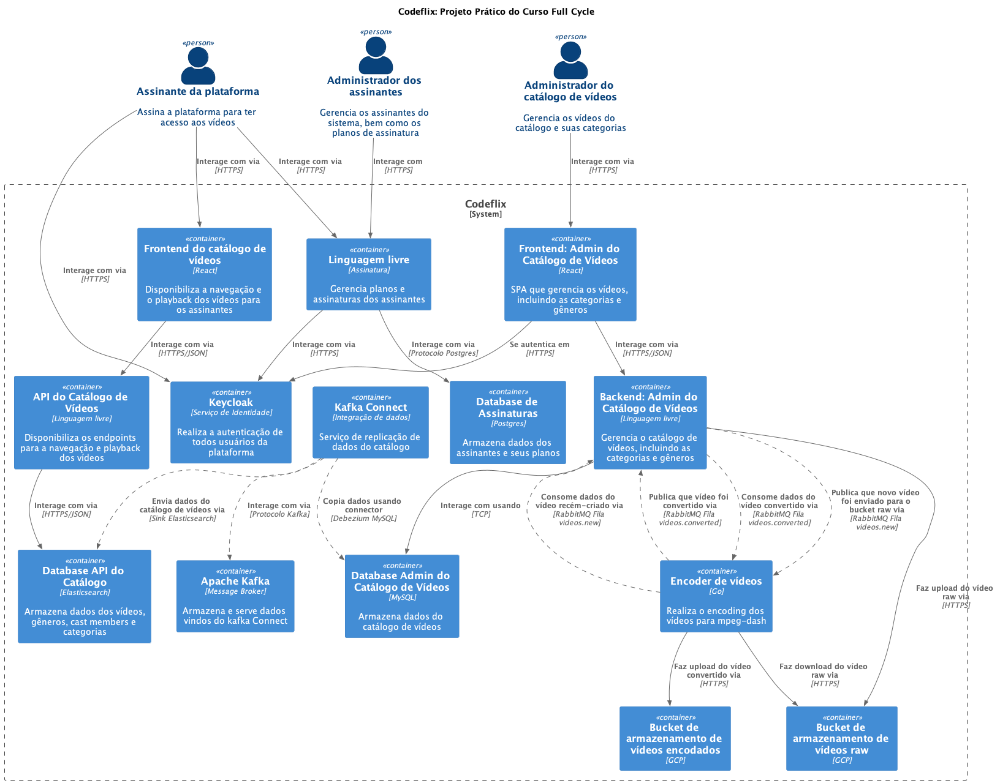

# Curso Full Cycle 3.0 - Módulo Arquitetura do Projeto Prático - Codeflix

    
    

---

## Descrição

O Curso Full Cycle é uma formação completa para fazer com que pessoas desenvolvedoras sejam capazes de trabalhar em projetos expressivos sendo capazes de desenvolver aplicações de grande porte utilizando de boas práticas de desenvolvimento.

---

## Repositório Pai
https://github.com/alcir-junior-caju/study-full-cycle-3-0

---

## Visualizar o projeto na IDE:

Para quem quiser visualizar o projeto na IDE clique no teclado a tecla `ponto`, esse recurso do GitHub é bem bacana

---

### CodeFlix
- Uma espécie de Netflix;
- Assinatura do serviço pelo cliente;
- Catálogo de vídeos para navegação;
- Playback de vídeos;
- Busca full text no catálogo;
- Processamento e encoding dos vídeos;
- Administração do catálogo de vídeos;
- Administração do serviço de assinatura;
- Autenticação;

### Decisões de projeto e de arquitetura
- Microserviços:
    - Arquitetura baseada em microserviços;
    - Tecnologia adequada para cada contexto, ex.: Go para processar vídeos;
    - Não existe uma única verdade na escolha das tecnologias;
    - Microserviços podem ser substituídos por outros com tecnologias diferentes;
    - Cada micro serviço terá seu próprio processo de CI/CD;
- Escala horizontal:
    - O processo de escala poderá ser configurado a nível de microserviço;
    - Todos os microserviços trabalharão de forma `Stateless`;
    - Quando utilizado upload de qualquer tipo de asset, o mesmo será armazenado em um Cloud Storage;
    - O processo de escala se dará no aumento da quantidade de `PODs` do Kubernetes;
    - O processo de autoscaling também será utilizado através de um recurso chamado HPA (Horizontal Pod Autoscaler);
- Service Discovery:
    - Não haverá a necessidade de trabalhar com um sistema de Service Discovery como `Consul`;
    - O projeto utilizará o Kubernetes para orquestrar os containers, logo o Service Discovery já faz parte do processo;
- Consistência Eventual:
    - Grande parte da comunicação entre os serviços será assíncrona;
    - Cada microserviço possuirá sua própria base de dados;
    - Eventualmente os dados poderão ficar inconsistentes, desde que não haja prejuízo direto ao negócio;
- Duplicação de Dados:
    - Eventualmente um microserviço poderá persistir dados já existentes em outro microserviço em seu banco de dados;
    - Essa duplicação ocorre para deixar o microserviço mais autônomo e preciso;
    - O microserviço duplicará apenas os dados necessários para seu contexto;
    - No caso da CodeFlix utilizaremos o Kafka Connect como replicador de dados;
- Mensageria:
    - Como parte da comunicação entre os microserviços é assíncrona, um sistema de mensageria é necessário;
    - O RabbitMQ foi escolhido para esse caso;
    - Por que não o Apache Kafka ou Amazon SQS, entre outros?
        - Apache Kafka também poderia ser utilizado nesse caso, por outro lado, foi decidido utilizar o Kafka juntamente com o Kafka Connect apenas para a replicação de dados;
        - Evitaremos ao máximo o Lock-in nos clouds providers, logo, Amazon SQS e similares foram descartados;
        - Não há uma verdade única sobre a escolha da tecnologia;
- Resiliência e Self Healing:
    - Para garantir resiliência caso um ou mais microserviços fiquem fora do ar, as filas serão essenciais;
    - Caso uma mensagem venha em um padrão não esperado para determinado microserviço, o microserviço poderá rejeitá-la e automaticamente a mesma será encaminhada para uma Dead-letter queue;
    - Pelo fato do Kubernetes e Istio possuirem recursos de Circuit Breaker e Liveness e Readiness probes:
        - Se um container tiver um crash, automaticamente ele será reiniciado ou mesmo recriado;
        - Caso o container não aguente determinado tráfego, temos a opção de trabalhar com Circuit Breaker para impedir que ele receba mais requisições enquanto está se `curando`;
- Autenticação:
    - Serviço centralizado de identidade opensource `Keycloak`;
    - OpenID Connect;
    - Customização de tema;
        - Utilizando o React;
    - Compartilhamento de chave pública com os serviços para verificação de autenticação dos tokens;
    - Diversos tipos de ACL;
    - Flow de autenticação para frontend e backend;

### Microserviços
- Backend Admin do Catálogo de Vídeos;
- Frontend Admin do Catálogo de Vídeos;
- Encoder de Vídeos;
- Backend API Catálogo de Vídeos;
- Frontend do Catálogo;
- Assinatura do CodeFlix pelo cliente;
- Autenticação entre microserviços com Keycloak;
- Comunicação assíncrona entre os microserviços com RabbitMQ;
- Replicação de dados utilizando Apache Kafka e Kafka Connect;

### Ambiente de desenvolvimento
- Docker é o protagonista do ambiente de desenvolvimento;
- Permite a rápida criação do ambiente;
- Garante que os ambientes serão exatamente os mesmos;
- Facilita a criação de recursos periféricos com banco de dados, RabbitMQ, etc;
- Geração de imagens para o ambiente de produção;

### CI/CD
- Para cada `Pull Request` gerada em uma aplicação, iniciaremos o processo de CI;
- Github Actions;
- O processo de CI será capaz de:
    - Subir a aplicação usando docker;
    - Executar os testes;
    - Utilizar o Sonarqube;
- No caso de acontecer o `merge` da `Pull Request`, o processo de CD acontece;
- Fará a geração da imagem Docker;
- Realizará o upload da imagem em um container registry;
- Executará o deploy no kubernetes;

### Kubernetes
- Clusters Kubernetes gerenciado;
- O deploy da aplicação;
- Startup, Readiness e Liveness Probe para self healing;
- Horizontal Pod Autoscaler (HPA) para escalar horizontalmente a aplicação;

### Cloud Providers
- IaC (Infra as Code);
    - Terraform;
    - Ansible;
- Providers;
    - AWS;
    - GCP;
    - Azure;

### Diagram C4 do sistema

